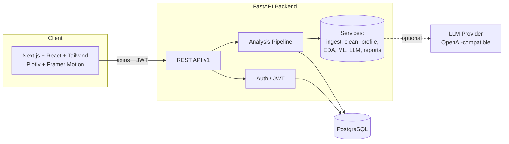

# AI BI Platform

> AI-powered Business Intelligence: upload a CSV, Excel, or JSON file (or connect a SQL database) and instantly get automatic data cleaning, profiling, exploratory analysis, interactive dashboards, ML-driven feature importance, natural-language querying, executive summaries, and downloadable PDF/Excel reports.


---

## Features

- **Multi-source ingestion** - CSV, Excel (`.xlsx`/`.xls`), JSON, and read-only SQL queries.
- **Real-time streaming ingestion** - push record batches over HTTP, WebSocket, or Redis Streams; live rolling metrics streamed to the dashboard via Server-Sent Events.
- **Automatic data cleaning** - column normalisation, type coercion, de-duplication, empty row/column removal, and median/mode imputation.
- **Data quality report** - completeness, uniqueness, and validity scoring (0-100) with actionable issues.
- **Missing-value & outlier detection** - per-column missingness and IQR-based outlier counts.
- **Data profiling** - dtype, cardinality, and summary statistics for every column.
- **Exploratory Data Analysis** - descriptive stats, Pearson correlation matrix, histograms, and category distributions.
- **Trend analysis** - time-series aggregation with slope/direction detection.
- **Feature importance** - auto-selects XGBoost, LightGBM, or scikit-learn RandomForest based on availability and task type.
- **Automatic insights & KPIs** - rule-based insight engine and dashboard KPI cards.
- **Natural-language querying** - ask questions in plain English (LLM-backed, with a deterministic fallback that works with no API key).
- **Executive summary generation** - concise, stakeholder-ready narrative.
- **Report export** - download polished PDF (ReportLab) and multi-sheet Excel (XlsxWriter) reports.
- **Auth & security** - JWT access/refresh tokens, bcrypt hashing, CORS, and security headers.
- **Modern responsive UI** - Next.js + Tailwind with Plotly charts and Framer Motion animations.

## Architecture



The analysis pipeline (`app/services/pipeline_service.py`) orchestrates ingestion, cleaning, profiling, EDA, ML feature-importance, insight generation, and executive-summary creation. Each concern is an isolated, independently testable service.

## Technology stack

| Layer | Technologies |
| --- | --- |
| Frontend | Next.js 14, React 18, TypeScript, Tailwind CSS, Plotly, Framer Motion, Zustand, Axios |
| Backend | FastAPI, Python 3.11, Pydantic v2, SQLAlchemy 2, Alembic, loguru |
| Database | PostgreSQL 16 |
| Machine Learning | scikit-learn, XGBoost, LightGBM, pandas, NumPy, SciPy |
| Reporting | ReportLab (PDF), XlsxWriter (Excel) |
| Auth | JWT (python-jose), bcrypt (passlib) |
| Tooling | Ruff, Black, ESLint, Prettier, Pytest, Vitest |
| Infra | Docker, Docker Compose, GitHub Actions |

## Project structure

```
ai-bi-platform/
|- backend/
|  |- app/
|  |  |- api/            # routes + dependencies + aggregate router
|  |  |- core/           # config, security, logging
|  |  |- db/             # engine, session, Base
|  |  |- models/         # SQLAlchemy ORM models
|  |  |- schemas/        # Pydantic schemas
|  |  |- services/       # ingestion, profiling, analytics, ML, LLM, reports, pipeline
|  |  |- main.py         # FastAPI app
|  |  |- seed.py         # demo user + sample dataset
|  |- sample_data/       # synthetic sales.csv
|  |- tests/             # pytest unit + integration tests
|  |- Dockerfile
|  |- requirements.txt
|  |- pyproject.toml
|- frontend/
|  |- src/
|  |  |- app/            # Next.js app router pages
|  |  |- components/     # UI primitives, charts, dashboard panels
|  |  |- lib/            # api client + types
|  |  |- store/          # Zustand auth store
|  |- Dockerfile
|  |- package.json
|- .github/workflows/    # CI pipeline
|- docs/                 # API docs, contributing guide
|- docker-compose.yml
```

## Quick start (Docker)

```bash
git clone https://github.com/sivamutukuri/ai-bi-platform.git
cd ai-bi-platform
cp backend/.env.example backend/.env   # then set SECRET_KEY (and LLM_API_KEY optionally)
docker compose up --build
```

- Frontend: http://localhost:3000
- Backend API docs (Swagger): http://localhost:8000/docs

## Local development

### Backend

```bash
cd backend
python -m venv .venv && source .venv/bin/activate
pip install -r requirements.txt
cp .env.example .env
# Start PostgreSQL (or: docker compose up db -d)
python -m app.seed          # optional: demo user + sample dataset
uvicorn app.main:app --reload
```

### Frontend

```bash
cd frontend
npm install
cp .env.example .env.local
npm run dev
```

## Demo credentials

After running `python -m app.seed`:

```
email:    demo@aibi.dev
password: demo12345
```

## Testing

```bash
# Backend
cd backend && pytest

# Frontend
cd frontend && npm test
```

## API overview

All endpoints are prefixed with `/api/v1`. See [docs/API.md](docs/API.md) for the full reference.

| Method | Endpoint | Description |
| --- | --- | --- |
| POST | `/auth/register` | Create an account |
| POST | `/auth/login` | Obtain access + refresh tokens |
| POST | `/auth/refresh` | Refresh tokens |
| GET | `/auth/me` | Current user |
| POST | `/datasets/upload` | Upload CSV/Excel/JSON |
| POST | `/datasets/connect-sql` | Connect a SQL source |
| GET | `/datasets` | List datasets |
| POST | `/analysis/{id}/run` | Run the full analysis pipeline |
| POST | `/analysis/query` | Natural-language query |
| POST | `/analysis/{id}/summary` | Executive summary |
| POST | `/reports/generate` | Download PDF/Excel report |

## License

Released under the MIT License. See [LICENSE](LICENSE).
# ai-bi-platform
AI-powered Business Intelligence platform: upload CSV/Excel/JSON or connect SQL, auto data cleaning, EDA, ML insights, NL querying, and PDF/Excel reports.
